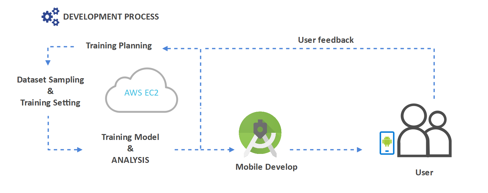
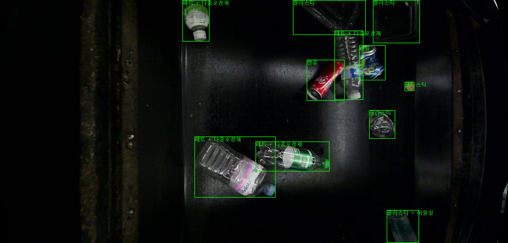

# Team BIO : 재활용품 분리배출 도우미

  

## 프로젝트 소개

모바일 환경에서 YOLOv8기반 Object Detection으로 재활용 쓰레기를 탐지하여 사용자들에게 올바른 재활용 가이드 라인을 제공한다.

사용한 Dataset - [AI-HUB 생활폐기물 데이터 ](https://aihub.or.kr/aihubdata/data/view.do?currMenu=115&topMenu=100&aihubDataSe=realm&dataSetSn=71385)

<h1>📚 OUR STACKS</h1>
  
           
          
   
             
     

  
## 구현 기능

### 기능 1 : 재활용품 탐지 - 모바일 서비스

&nbsp;&nbsp;&nbsp;&nbsp;사용자는 모바일 어플을 통해 재활용 쓰레기의 정확한 품목을 알 수 있다.

### 기능 2 : 재활용 가이드 제공 - 모바일 서비스

&nbsp;&nbsp;&nbsp;&nbsp;사용자에게 탐지된 재활용품의 처리 가이드 라인을 제공한다.

  

### 기능 3 : 데이터 시각화 - 개발자 도구

&nbsp;&nbsp;&nbsp;&nbsp;모델의 파이프라인을 수정하여 탐지한 물체의 이미지 벡터를 추출할 수 있다.

&nbsp;&nbsp;&nbsp;&nbsp;추출한 이미지 벡터로 T-SNE 및 PCA 시각화를 진행 후, 내부적으로 정성 평가를 위해 각 이미지를 비교할 수 있도록 도구를 개발하였다.

<table>
  <tr>
    <td>
      

        
        
다른 공간 같은 Class 이미지 예시

      

    </td>
    <td>
      

        
        
비슷한 공간 다른 Class 이미지 예시

      

    </td>
  </tr>
</table>

 

## 개발 과정 간략도

  

## 디렉토리 설명

Garbage-Classification 
┣ [Mobile_Develop](https://github.com/mindang/Garbage-Classification/tree/main/Mobile_Develop) &nbsp;&nbsp;&nbsp;&nbsp;&nbsp;&nbsp;&nbsp;&nbsp;&nbsp;&nbsp;&nbsp;&nbsp;&nbsp;&nbsp;&nbsp;# 어플리케이션 개발 폴더 
┃ ┗ [app](https://github.com/mindang/Garbage-Classification/tree/main/Mobile_Develop/app) &nbsp;&nbsp;&nbsp;&nbsp;&nbsp;&nbsp;&nbsp;&nbsp;&nbsp;&nbsp;&nbsp;&nbsp;&nbsp;&nbsp;&nbsp;&nbsp;&nbsp;&nbsp;&nbsp;&nbsp;&nbsp;&nbsp;&nbsp;&nbsp;&nbsp;&nbsp;&nbsp;&nbsp;&nbsp; #  어플리케이션 코드 
┣ [Model_Develop](https://github.com/mindang/Garbage-Classification/tree/main/Model_Develop) &nbsp;&nbsp;&nbsp;&nbsp;&nbsp;&nbsp;&nbsp;&nbsp;&nbsp;&nbsp;&nbsp;&nbsp;&nbsp;&nbsp;&nbsp;&nbsp;# 모델 및 데이터셋 관련 폴더 
┃ ┣ [Custom_Model](https://github.com/mindang/Garbage-Classification/tree/main/Model_Develop/Custom_Model) &nbsp;&nbsp;&nbsp;&nbsp;&nbsp;&nbsp;&nbsp;&nbsp;&nbsp;&nbsp;&nbsp; # 기존 YOLO 패키지 수정  
┃ ┣ [Dataset_Sampling](https://github.com/mindang/Garbage-Classification/tree/main/Model_Develop/Dataset_Sampling)&nbsp;&nbsp;&nbsp;&nbsp;&nbsp;&nbsp;&nbsp;&nbsp;# 데이터셋 샘플링 관련 코드 
┃ ┣ [Dataset_Visualization](https://github.com/mindang/Garbage-Classification/tree/main/Model_Develop/Dataset_Visualization)&nbsp;&nbsp;&nbsp;# 데이터셋 시각화 관련 코드 
┃ ┗ [Model_Train](https://github.com/mindang/Garbage-Classification/tree/main/Model_Develop/Model_Train) &nbsp;&nbsp;&nbsp;&nbsp;&nbsp;&nbsp;&nbsp;&nbsp;&nbsp;&nbsp;&nbsp;&nbsp;&nbsp;&nbsp;&nbsp;&nbsp;&nbsp;# 모델 가중치 및 결과    

## 현재 및 향후 기대 효과

<table>
  <tr>
    <td>
      

        
      

    </td>
    <td>
      

        
      

    </td>
  </tr>
</table>

**[배경]** 대한민국 가정에서 버린 쓰레기는 모두 각 지역구 선별장으로 이동하게 되며 일부 자동화 선별장을 제외한 대부분은 사람이 직접 수작업 분류를 진행하고 있다.
 

**<첫째>**

현재는 사용자가 직접 쓰레기를 비추며 안내문을 출력하지만 IOT서비스와 연결하여 SMART쓰레기통 , SMART주방 , SMART분리수거장으로 활용할 수 있다.

이렇게 가정에서 1차적으로 재활용품 분류가 잘 될수록 다음 처리단계인 선별장에서 노동자들의 업무 부담을 줄일 수 있으며 친환경 사회로 나아갈 수 있다.
 

**<둘째>**

선별장환경에 맞춰 모델을 학습한다면 로봇을 이용하여 적은 임금을 받으며 열약한 환경에서 근무하는 노동자의 노동환경을 개선할 수 있다.

로봇을 이용하여 선별장에서 대규모 , 오염된 쓰레기를 분류한다면 업체는 적은 임금비용으로 노동자는 쾌적한 환경에서 근무 가능할 것이다.
 

