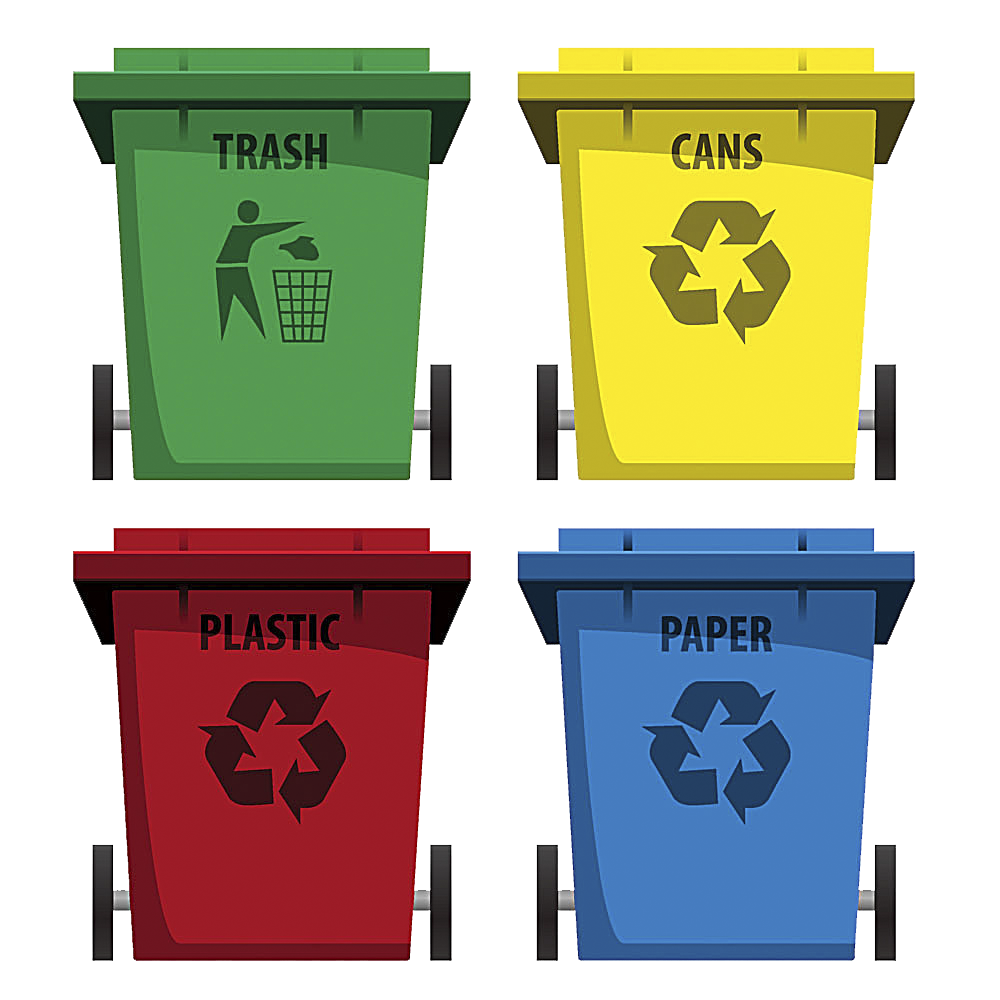

# Garbage-Classification

# 프로젝트 이름

   
  
   

목차

## 프로젝트 소개

Yolo v8n 버전과 AI HUB의 재활용쓰레기 데이터셋을 이용한 재활용 분류 모델

 

<h1>📚 OUR STACKS</h1>
  
           
          
   
             
     

  
 

## 구현 기능

### 기능 1

### 기능 2

### 기능 3

### 기능 4

 

## 배운 점 & 아쉬운 점

 

## 라이센스

MIT &copy; [NoHack](mailto:lbjp114@gmail.com)

<!-- Stack Icon Refernces -->
