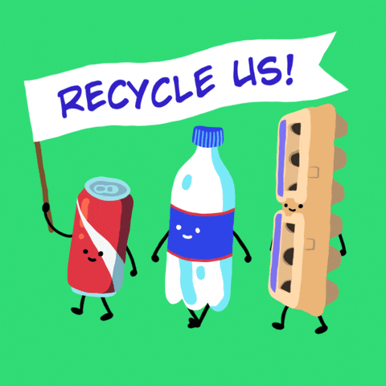
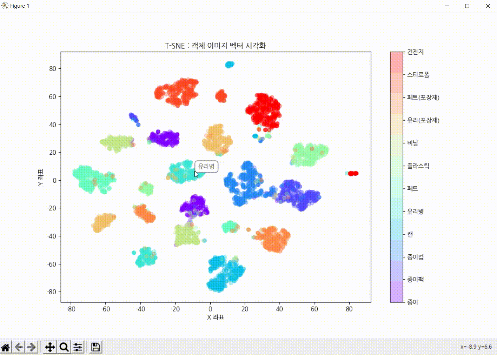
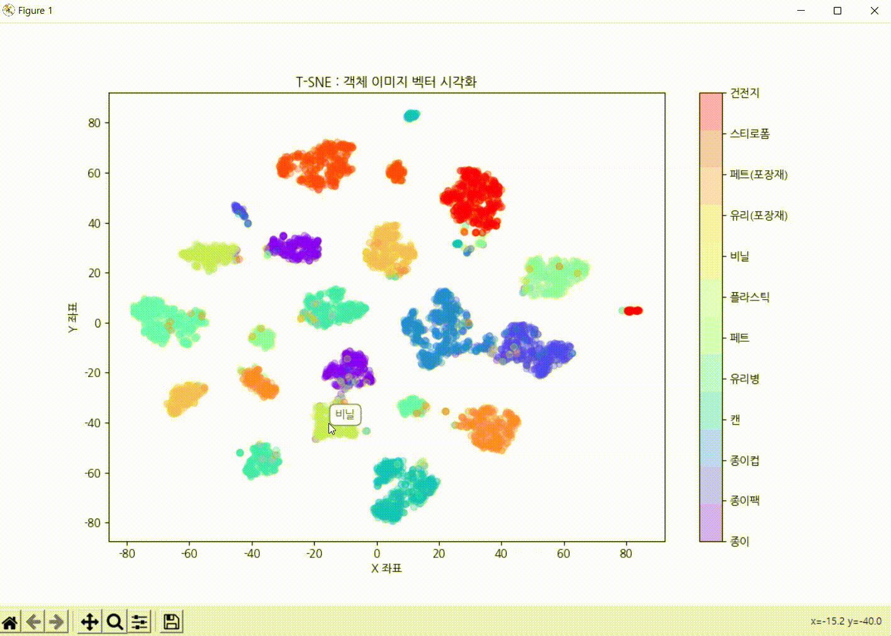

# Team BIO : 재활용품 분리배출 도우미

  

## 프로젝트 소개

모바일 환경에서 YOLOv8기반 Object Detection으로 재활용 쓰레기를 탐지하여 사용자들에게 올바른 재활용 가이드 라인을 제공한다.

사용한 Dataset - [AI-HUB 생활폐기물 데이터 ](https://aihub.or.kr/aihubdata/data/view.do?currMenu=115&topMenu=100&aihubDataSe=realm&dataSetSn=71385)

<h1>📚 OUR STACKS</h1>
  
           
          
   
             
     

  
 

## 구현 기능

### 기능1. 재활용품 탐지 - 모바일 서비스

&nbsp;&nbsp;&nbsp;&nbsp;사용자는 모바일 어플을 통해 쓰레기의 중심좌표 , 크기 , 품목을 알 수 있다.

### 기능 2 : 재활용 가이드 제공 - 모바일 서비스

&nbsp;&nbsp;&nbsp;&nbsp;사용자에게 탐지된 재활용품의 처리 가이드 라인을 제공한다.

### 기능 3 : 데이터 시각화 - 개발자 도구

&nbsp;&nbsp;&nbsp;&nbsp;모델의 파이프라인을 수정하여 탐지한 물체의 이미지 벡터를 추출할 수 있다.

&nbsp;&nbsp;&nbsp;&nbsp;추출한 이미지 벡터로 T-SNE 및 PCA 시각화를 진행하였고,
&nbsp;&nbsp;&nbsp;&nbsp;내부적으로 정성 평가를 위해 각 이미지를 비교할 수 있도록 도구를 개발하였다.

<table>
  <tr>
    <td>
      

        
        
다른 공간 같은 Class 이미지 예시

      

    </td>
    <td>
      

        
        
비슷한 공간 다른 Class 이미지 예시

      

    </td>
  </tr>
</table>

 

## 디렉토리 설명

Garbage-Classification           
┣ Mobile_Develop  
┣ Model_Develop   
┃ ┣ Custom_Model  
┃ ┃ ┗ ultralytics  
┃ ┣ Dataset_Sampling  
┃ ┣ Dataset_Visualization  
┃ ┗ Model_Train

## 활용방안 및 기대효과

 

## 라이센스

MIT &copy; [NoHack](mailto:lbjp114@gmail.com)

<!-- Stack Icon Refernces -->
